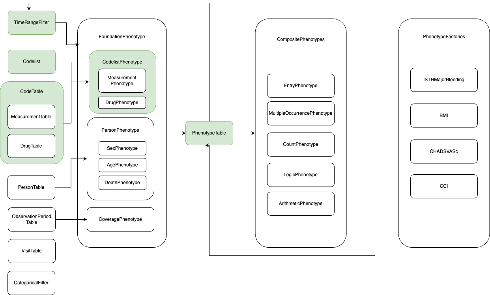

PhenEx

Implementing observational studies using real-world data (RWD) is challenging, requiring expertise in epidemiology, medical practice, statistics and data engineering. Observational studies are often implemented as bespoke software packages by individual data analysts or small teams. While tools exist to help, such as open-source tools from the [OHDSI community](https://ohdsi.github.io/Hades/) in the R language and proprietary tools, they are typically bound to a specific data model (e.g. [OMOP](https://ohdsi.github.io/CommonDataModel/cdm54.html)) and limited in their ability to express and implement complicated medical definitions.

PhenEx (Automated Phenotype Extraction) fills this gap. PhenEx is a Python-based software package that provides reusuable and end-to-end tested implementations of commonly performed operations in the implementation of observational studies. The main advantages of PhenEx are:

- **Arbitrarily complex medical definitions**: Build medical definitions that depend on diagnoses, labs, procedures, and encounter context, as well as on other medical definitions
- **Data-model agnostic**: Work with almost any RWD dataset with only extremely minimal mappings required. Only map the data needed for the study execution.
- **Portable**: Built on top of [ibis](https://ibis-project.org/), PhenEx works with any backend that ibis supports, including snowflake, PySpark and many more!
- **Intuitive interface**: Study specification in PhenEx mirrors plain language description of the study.
- **High test coverage**: Full confidence answer is correct.

## Basics of PhenEx design

### Electronic phenotypes

The most basic concept in PhenEx is the (electronic) [phenotype](https://rethinkingclinicaltrials.org/chapters/conduct/electronic-health-records-based-phenotyping/electronic-health-records-based-phenotyping-introduction/). A phenotype defines a set of patients that share some physiological state. In a clinical setting, a phenotype is usually identified by the phrase "patient presents with ...". For example, a phenotype could be "patient presents with diabetes". In the observational setting, we would cacluate the phenotype "patient presents with diabetes" by looking for patients who have a diagnosis of diabetes in their medical record in certain time frame.

A phenotype can reference other phenotypes. For instance, the phenotype "untreated diabetic patients" might translate to real-world data as "having a diagnosis of diabetes but not having a prescription for insulin or metformin". In this case, the prescription phenotype refers to the diabetes phenotype to build the overall phenotype. In PhenEx, your job is to simply specify these criteria. PhenEx will take care of the rest.

All studies are built through the calculation of various phenotypes:

- entry criterion phenotype
- inclusion phenotypes
- exclusion phenotypes
- baseline characteristic phenotypes, and
- outcome phenotypes.

After defining the parameters of all these phenotypes in the study definition file, PhenEx will compute the phenotypes and return a cohort table, which contains the set of patients which satisfied all the inclusion / exclusion / entry criteria for the specified study. Additionally, a baseline characteristics table will be computed and reports generated, including a waterfall chart, the distributions of baseline characteristics.

### Phenotype classes

In PhenEx, the concept on an electronic phenotype is encapsulated by Phenotype classes that expose all relevant parameters to express an electronic phenotype. These classes are designed to be reusable and composable, allowing complex phenotypes to be built from simpler ones. The foundational Phenotype classes include:

| Phenotype Class             | Identify patients using ...                               | Example                                                                            |
| --------------------------- | --------------------------------------------------------- | ---------------------------------------------------------------------------------- |
| CodelistPhenotype           | Medical code lists (e.g. ICD10CM, SNOMED, NDC, RxNorm)    | All patients with a diagnosis code for atrial fibrillation one year prior to index |
| MeasurementPhenotype        | Numerical values such as lab tests or observation results | All patients with systolic blood pressure greater than 160                         |
| ContinuousCoveragePhenotype | Observation coverage data                                 | One year continuous insurance coverage prior to index                              |
| AgePhenotype                | Date of birth data                                        | Age at date of first atrial fibrillation diagnosis                                 |
| DeathPhenotype              | Date of death data                                        | Date of death after atrial fibrillation diagnosis                                  |

These foundational Phenotype's allow you to express complex constraints with just keyword arguments. For example, in CodelistPhenotype, you can specify that the diagnosis must have occurred in the inpatient setting or in the primary position in the outpatient setting. Phenotype's can refer to other Phenotype's in specifying their constraints. For example, "one year preindex" refers to another Phenotype which defines the index date.

Furthermore, they can be combined using the following derived Phenotypes:

| Phenotype Class     | Identify patients using ...                       | Example                                                                             |
| ------------------- | ------------------------------------------------- | ----------------------------------------------------------------------------------- |
| LogicPhenotype      | Logical combinations of any other phenotypes      | high blood pressure observation OR blood pressure medication in the baseline period |
| ArithmeticPhenotype | Mathematical combinations of any other phenotypes | BMI at index                                                                        |
| ScorePhenotype      | Logical combinations of any other phenotypes      | CHADSVASc, CCI, HASBLED                                                             |

Each phenotype class provides methods for defining the criteria and for evaluating the phenotype against a dataset. By using these classes, researchers can define complex phenotypes in a clear and concise manner, without needing to write custom code for each study.

### Architecture

Below is an illustration of the basic design of the PhenEx in the evidence generation ecosystem.

## Getting started

To get started, head over to our [tutorials](tutorials.md) to get a better feel for how the library works. Then, learn how to [install PhenEx](installation.md) and start using it yourself for your own studies. Any questions? Feel free to reach out or create a [github issue](https://github.com/Bayer-Group/PhenEx/issues).
